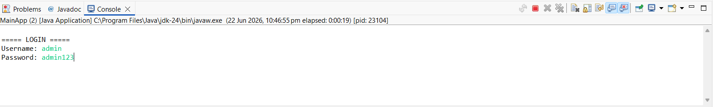
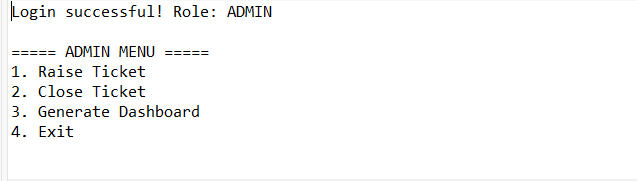
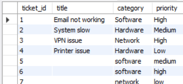
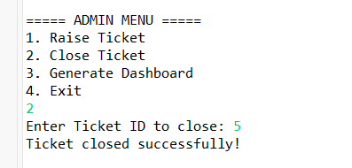
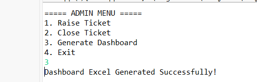

# IT Ticket Management System

## Project Overview

The IT Ticket Management System is a Java-based application developed using JDBC, MySQL, and Apache POI. It enables organizations to efficiently manage IT support requests by allowing administrators to create, assign, track, and close tickets. The system also generates Excel-based dashboard reports for monitoring ticket trends and engineer performance.

## Features

* Secure Admin Login
* Raise IT Support Tickets
* Assign Tickets to Engineers
* Close Resolved Tickets
* Category-wise Ticket Tracking
* Priority-based Ticket Management
* Engineer Performance Reporting
* Excel Dashboard Generation
* MySQL Database Integration

## Technologies Used

* Java
* JDBC
* MySQL
* Apache POI
* Eclipse IDE

## Project Structure

```text
src/
├── dao/
├── main/
├── model/
├── service/
└── util/

database/
└── database.sql

screenshots/
└── project screenshots
```

## Database Setup

1. Install MySQL Server.
2. Create a database named:

```sql
CREATE DATABASE it_ticket_system;
```

3. Execute the SQL script:

```text
database/database.sql
```

4. Update database credentials in:

```text
src/util/DBConnection.java
```

## How to Run

1. Clone the repository:

```bash
git clone https://github.com/abhinav61277/IT-Ticket-System.git
```

2. Open the project in Eclipse IDE.
3. Add MySQL Connector/J library.
4. Add Apache POI libraries.
5. Configure the MySQL database.
6. Execute `database.sql`.
7. Run `MainApp.java`.

## Screenshots

### Login Screen



### Admin Dashboard



### Database Records



### Close Ticket



### Dashboard Generation



## Sample Reports Generated

* IT_Ticket_Dashboard.xlsx
* Engineer_Report.xlsx
* Category_Report.xlsx

## Future Enhancements

* Email Notifications
* Web-Based Dashboard
* REST API Integration
* Role-Based Access Control
* Spring Boot Migration

## Author

**Abhinav Reddy**

GitHub: https://github.com/abhinav61277

## License

This project is licensed under the MIT License.
